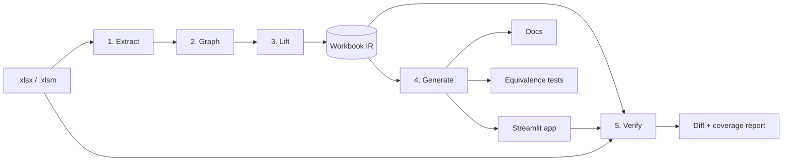

# Bob Killer — Build Spec

Sep 25, 2026 · @Jason Touleyrou

## Purpose

Bob Killer turns an Excel workbook into three things generated from one spec: a Streamlit app, plain-English documentation, and an equivalence test suite proving the app matches the workbook.

The pitch: upload Bob's 2013 workbook, get back a documented, tested app whose code you own, and Bob can still change the numbers.

The spec in the middle is the product. The app, docs and tests are all compiled from it, so nothing is written twice.

**Design principles**

- **Spec-first.** Excel is parsed into a normalized Workbook IR. Every output is generated from the IR, never directly from cells.
- **Deterministic before generative.** Parsing, graph building and formula translation are plain code. The LLM is used only to draft descriptions and translate VBA, and every LLM output is checked by a deterministic test or a human. Names come from a deterministic registry.
- **Excel is the oracle.** Expected values come from the workbook's cached results or from real Excel through the oracle service, never from the LLM or the code under test.
- **Honest scope.** Anything unsupported is flagged in a coverage report. Nothing is silently approximated.
- **Config over code.** New Excel functions, generators and output targets are added by registering a plugin, not by editing core.

**Non-goals for v1**

- Pivot tables, Power Query, Solver, data tables, charts and external workbook links. These are detected and reported, not converted.
- VBA that drives other applications through COM (Outlook, file system automation, UserForms).
- Round-tripping the app back into Excel.
- Multi-user editing or authentication in the generated app.

## Architecture

The system is a compiler with five stages. Each stage has one input type, one output type, and its own test suite.



| Stage | Input | Output | Deterministic? |
| --- | --- | --- | --- |
| 1. Extract | Workbook file | `RawWorkbook`: cells, formulas as text, cached values, named ranges, tables, VBA source, unsupported-feature list, written to the Raw layer of workbook.db | Yes |
| 2. Graph | `RawWorkbook` | `CellGraph`: parsed formula ASTs, dependency DAG, cycles, volatile and dynamic refs flagged | Yes |
| 3. Lift | `CellGraph` | `WorkbookIR`: inputs, lookup tables, vectorized calculation steps, outputs | Yes; names come from the naming registry |
| 4. Generate | `WorkbookIR` | App code, Markdown docs, pytest suite | Yes (templates) |
| 5. Verify | IR + app + original workbook | Equivalence diff report and coverage percentage | Yes |

**Key stage behaviors**

- **Extract** uses `openpyxl` twice: once for formulas, once with `data_only=True` for cached values. VBA comes out through `oletools.olevba`. Extraction never evaluates or executes anything. Uploads are checked for decompressed size before unzipping.
- **Graph** parses formulas into our own AST on top of openpyxl's MIT tokenizer. It does not wrap the `formulas` library. It topologically sorts cells and reports cycles and `INDIRECT`/`OFFSET` usage explicitly.
- **Lift** collapses repetition. A column of `=B2*C2` through `=B5000*C5000` becomes one vectorized step, detected through R1C1-normalized formula fingerprints. Hardcoded numbers inside formulas are promoted to named parameters.
- **Generate** renders Jinja templates from the IR. Generated code imports one shared runtime library. It never inlines Excel semantics per app.
- **Verify** runs the generated calculation module against inputs from the workbook and compares outputs to Excel's cached values and to oracle results for generated input sets, and requires exact equality.

## Workbook IR

The IR is a versioned YAML export of workbook.db (decision 9), validated by Pydantic models. Generators read it, humans change it only through the review API, and `schema_version` gates compatibility.

```yaml
schema_version: 1
source:
  file: bobs_forecast_2013.xlsm
  sha256: 9f2c...
  extracted_at: 2026-09-25T14:00:00Z

parameters:            # hardcodes promoted to named, editable values
  - id: growth_rate
    label: Annual growth rate
    type: percent
    default: 0.035
    origin: [Assumptions!C4]
    description: Applied to prior-year revenue.   # LLM-authored, human-reviewed

inputs:                # cells users type into
  - id: units_sold
    type: table
    columns: {region: text, units: float64, price: float64}   # Excel stores every number as a double
    origin: Data!A1:C200

lookups:
  - id: region_tax
    origin: Rates!A2:B12
    key: region

steps:                 # topologically ordered, vectorized
  - id: revenue
    kind: column_expr
    expr: units * price
    over: units_sold
    origin: Data!D2:D200
    fingerprint: "=RC[-2]*RC[-1]"
  - id: total_tax
    kind: aggregate
    expr: sum(revenue * lookup(region_tax, region))
    origin: [Summary!B7]

outputs:
  - id: total_tax
    label: Total tax owed
    format: currency

unsupported:           # surfaced in the coverage report, never hidden
  - kind: pivot_table
    origin: Pivot!A1
    reason: pivot tables are out of scope for v1

vba:
  - module: Module1
    procedure: RefreshAll
    status: needs_review
    translated_to: null
```

**IR rules**

- Every node has an `id` and an `origin` pointing back to cells. That traceability drives both the docs and the test oracle.
- `expr` uses a small, Excel-agnostic expression language parsed into its own AST. Generators never re-parse Excel syntax.
- Step kinds form a closed registry: `scalar_expr`, `column_expr`, `aggregate`, `lookup`, `conditional`, `vba_procedure`. Adding a kind means registering one handler per generator.
- `description` and `label` fields hold free text. Labels come only from the naming registry; LLM text may land only in description.

## Repo layout and extension points

The layout is one package with stage modules, a shared runtime, and plugin registries. Python 3.12, Polars, Rust (stable, via maturin), `uv`, `ruff`, `mypy --strict`, `pytest`, `hypothesis`.

```text
bob-killer/
  CLAUDE.md
  SPEC.md                      # this document
  pyproject.toml
  src/bob_killer/
    extract/                   # stage 1
    graph/                     # stage 2: tokenizer, AST, DAG
    lift/                      # stage 3: fingerprinting, vectorizing, param promotion
    ir/                        # Pydantic models + YAML io + schema versions
    generate/
      base.py                  # Generator protocol
      streamlit/               # templates + generator
      docs/
      tests/
    verify/                    # oracle runner, diff, coverage
    runtime/                   # Excel semantics shared by all generated apps
      functions/               # one module per Excel function family
      coercion.py              # blank vs zero, text-to-number, bool math
      dates.py                 # 1900 serial dates incl. leap-year bug
      rounding.py
    contracts/                 # strict Pydantic models: the only type definitions
    store/                     # workbook.db: DDL generated from contracts, typed repository
    api/                       # FastAPI app: /runs, stage sub-resources, /reviews
    registry.py                # function, step-kind and generator registries
    cli.py                     # bob-killer extract|lift|generate|verify|all
  tests/
    fixtures/workbooks/        # small real .xlsx files, one behavior each
    unit/ integration/ golden/
  crates/excel-kernel/         # Rust Polars plugin: ordered reductions, rounding, dates
  services/oracle/             # separate service: real Excel or Microsoft Graph
  .context/                    # gitignored run artifacts, manifest.json
```

**DRY rules**

- Excel semantics live only in `runtime/`. Generated apps import it; they never contain their own `SUM` or date logic.
- Each Excel function is implemented once, registered once, and tested once against fixture cached values.
- Templates are composed from partials. A pattern used by two templates becomes one partial.
- The IR is the only contract between stages. No stage imports another stage's internals.

**Extension points**

| To add | You write | You register in |
| --- | --- | --- |
| An Excel function | One function in `runtime/functions/` + a fixture workbook | `registry.functions` via `@excel_function("XLOOKUP")` |
| A step kind | A Pydantic model + one handler per generator | `registry.step_kinds` |
| An output target (FastAPI, Snowflake Streamlit, dbt) | A class implementing `Generator` | `registry.generators` via entry points |
| An unsupported-feature detector | One detector function | `registry.detectors` |

The core never contains `if target == "streamlit"`. Branching on type goes through registries.

## TDD protocol and the recursive build loop

Every unit of work follows red, green, refactor, and the build order follows the dependency graph from leaves up. Nothing is implemented before a failing test exists for it.

**The loop (applies to building the tool and to converting a workbook)**

1. **Pick the next node.** Take the lowest unbuilt node in the dependency order: a runtime function before the step that uses it, a step before the output that depends on it.
2. **Red.** Write the test first. The expected value comes from a fixture workbook's cached value or a hand-verified constant. Run it and confirm it fails for the right reason. Record the failing run in `.context/`.
3. **Green.** Write the minimum code to pass. Do not edit the test.
4. **Refactor.** Remove duplication and move shared logic into `runtime/` or a partial. All tests stay green.
5. **Recurse up.** Mark the node built, then move to its parents. A parent's test may assume its children pass.
6. **Stop and report** when a node cannot be built: an unsupported function, a cycle, or a dynamic reference. Add it to `unsupported` with a reason and continue with the nodes that do not depend on it.

**Test layers**

| Layer | What it proves | Oracle |
| --- | --- | --- |
| Unit | One runtime function or one stage transform is correct | Fixture workbook cached values |
| Property | Invariants hold for any input: topological order is valid, vectorized step equals cell-by-cell evaluation | `hypothesis` generators |
| Golden | Generated code and docs for a fixture are byte-stable | Checked-in snapshot, updated only by explicit command |
| Integration | Full pipeline on a fixture workbook | Every output cell matches Excel within tolerance |

**Fixture discipline**

- One small workbook per behavior: `sum_with_blanks.xlsx`, `vlookup_approx.xlsx`, `leap_1900.xlsx`, `circular_iterative.xlsx`, `indirect_dynamic.xlsx`, plus order-sensitive summation fixtures.
- Fixtures are authored and saved in real Excel so cached values are genuine. A fixture without cached values is rejected by the test harness.
- The five public workbooks in the golden sample set are the end-to-end tests and the demo material for the articles.

## Verification and anti-cheat gates

Agents under TDD pressure will weaken tests, fake results, and tidy up afterwards, so every gate below is enforced by a script or hook, not by instructions alone.

**Gates enforced by hooks and CI**

| Gate | Check | Enforced by |
| --- | --- | --- |
| Red before green | A test file's commit precedes the implementation commit, and `.context/` holds its failing run | `scripts/check_tdd_order.py` in CI |
| Tests untouched in green | A green-phase commit may not modify existing assertions | Pre-commit diff check |
| No oracle literals | Integration and unit tests read expected values from cached values or recorded oracle results, not hardcoded numbers | AST lint on `tests/` |
| No silent skips | `skip`, `xfail` and `pytest.approx` in any form require a linked reason in `ALLOWLIST.md` | AST lint |
| Parity is exact | The comparator in `verify/config.py` has no tolerance parameter; any difference fails | AST lint |
| Tests actually bite | Mutation testing with `mutmut` on `runtime/` scores at least 80% killed | Nightly CI |
| Coverage is honest | Line coverage of at least 90% on `src/`; IR coverage report lists every unsupported node | CI |
| Types | `mypy --strict` and `ruff` clean | Pre-commit |

**Claude Code hooks**

- `PostToolUse` on edits under `src/` runs the affected tests and writes results to `.context/runs/<run_id>/`.
- `Stop` runs the full gate script. The agent cannot finish a task while any gate fails.
- Hook output is appended to an append-only log. A missing or rewritten log entry fails the run.

**The equivalence report**

Each conversion produces `report.md` with: cells checked, cells matched, the max absolute and relative difference, a table of every mismatch with its origin cell, and coverage measured two ways: by formula cells (the parity denominator, excluding macro-writable cells) and by IR steps. This report is the proof shown to the workbook's owner, and a strong visual for the articles.

## Roadmap

Seven phases, each ending in a demo-able artifact and an article. Do not start a phase until the previous phase's gates pass.

| Phase | Scope | Done when |
| --- | --- | --- |
| 0. Skeleton | Repo, `uv`, CI, hooks, gate scripts; `contracts/` with DDL, JSON Schema and OpenAPI generation plus snapshot tests; `import-linter` boundaries; FastAPI skeleton with `POST /runs`; upload size limits; empty registries; `fetch_golden.py` and `golden.lock` | CI runs green on an empty pipeline; a deliberately cheating commit is rejected by the gates; a contract change without a version bump fails CI |
| 1. Extract + Graph + Oracle | Raw layer of `workbook.db`, tokenizer, AST, DAG, cycle and volatile detection, unsupported detectors, VBA inventory and macro-writable cell marking; oracle service that recalculates a workbook with given inputs and converts `.xls` to `.xlsx` in real Excel | Every golden workbook yields a correct topological order; every unsupported feature and macro-writable cell is listed; the oracle returns recalculated values for all 5 goldens |
| 2. Runtime + scalar IR | Python reference runtime (coercion, dates, rounding, reductions in Excel's empirically established order); functions ranked by frequency across the golden set; scalar and aggregate steps; Dictionary layer | Every function matches oracle values exactly; `workbook.db` to YAML to `workbook.db` round-trips identically |
| 3. Lift + Generate | Fingerprinting, vectorized `column_expr` in Polars, parameter promotion, naming rules and review API, Streamlit and docs generators | Each golden workbook becomes a running, `mypy`-clean, AppTest-passing app plus docs from a single upload |
| 4. Proof | Equivalence and coverage reports, governance trail (lineage, reviews, hashes); Rust kernel replaces the Python reference where profiling says so | 100% of non-VBA formula cells match exactly on all 5 golden workbooks from a single upload, with no allowlist entries |
| 5. VBA | LLM translation of pure-computation procedures behind tests | Each translated procedure matches recorded Excel output exactly; VBA-written cells rejoin the parity denominator |
| 6. Targets | Snowflake Streamlit generator reusing snowflake-excel-streamlit's bronze ingest; FastAPI target; Forge generates the CLI, SDK, docs and MCP server for Bob Killer's API and for each converted workbook's API (decision 10) | Same IR produces both apps with zero changes to core |

The first function list for phase 2 should come from counting function frequency across the fixture workbooks, not from guessing.

## CLAUDE.md

Paste this into the repo root. It points Claude Code at this spec and makes the loop explicit.

```markdown
# Bob Killer — working agreement

Read SPEC.md before any task. The Workbook IR is the only contract between stages.

## Loop (never skip a step)
1. Pick the lowest unbuilt node in dependency order (runtime fn → step → output).
2. RED: write the test. Expected values come from cached values or recorded oracle results only.
   Run it. Confirm it fails for the stated reason. Save the run to .context/.
3. GREEN: minimum code to pass. Never edit an existing assertion in this phase.
4. REFACTOR: remove duplication; Excel semantics go in src/bob_killer/runtime/.
5. Recurse to parents. Commit test and implementation separately, test first.
6. Blocked? Add the node to `unsupported` with a reason, continue with independent nodes.

## Hard rules
- No hardcoded expected numbers in tests. No tolerances anywhere: parity is exact.
- No skip/xfail without an entry in ALLOWLIST.md.
- No branching on target or kind in core; use registry.py.
- LLM output may only fill `description`, or VBA translations behind tests. Names come from workbook.db. Never hand-edit IR YAML.
- Every type is defined once in contracts/ as a strict Pydantic model.
- Never execute VBA or macros outside the isolated oracle runner.
- If a gate fails, report it. Never delete, rewrite or hide logs in .context/.

## Commands
- uv run pytest -q
- uv run python scripts/gates.py   # must pass before you stop
- uv run bob-killer all golden/sgec_tool.xlsm --out build/
- uv run fastapi dev src/bob_killer/api/main.py

## Start here
Phase 0 in SPEC.md. First task: scaffold the repo, then write the gate
scripts and prove each one rejects a deliberately bad commit.
```

Kick-off prompt for Claude Code: "Read SPEC.md and CLAUDE.md. Execute Phase 0 using the loop. Stop when the gates pass and show me the rejected-cheat evidence."

## Golden sample set

Five public workbooks, low to high complexity, replace the invented Bob workbook. Four are EPA or NREL tools; one is a Montana DOT template.

| # | Complexity | Workbook | What it stresses |
| --- | --- | --- | --- |
| 1 | Low | [Montana DOT MWTP Project Budget Worksheet](https://www.mdt.mt.gov/other/webdata/external/Planning/MWT/MWTP-Program/APPENDIX-B-Project-Budget-Worksheet-Example.pdf) (.xlsx) | Two sheets (COSTS, REVENUE), white input cells, gray formula cells, dropdowns, insertable rows |
| 2 | Low-mid | [EPA iWARM tool](https://www.epa.gov/warm/individual-waste-reduction-model-iwarm-tool) (.xlsm, 119 KB) | Small macro-enabled calculator, a results chart, assumptions and unit conversions |
| 3 | Mid | [EPA Simplified GHG Emissions Calculator](https://epa.gov/climateleadership/simplified-ghg-emissions-calculator) (.xlsm) | Many source sheets feeding one Summary sheet, emission-factor lookup tables, XLOOKUP, navigation macros |
| 4 | High | [NREL JEDI Wind model](https://www.nrel.gov/analysis/jedi/wind) (.xlsm) | Macros must be enabled to run; large input-output economic model with deep calculation chains |
| 5 | High | [EPA WARM Version 16](https://19january2025snapshot.epa.gov/warm/versions-waste-reduction-model/index.html) (listed as .xls, 3.44 MB) | Baseline vs. alternative scenarios, life-cycle factor tables, legacy file format |

**Bonus: version-diff pair.** Archived SGEC releases exist, such as [v4.1 from 2017](https://19january2017snapshot.epa.gov/sites/production/files/2017-01/sgec_tool_v4_1.xlsm) and [v5.1 from 2018](https://www.epa.gov/sites/default/files/2018-04/sgec_tool_v5_1.xlsm). Converting both and diffing the two IRs tests whether the spec shows what changed between versions.

**Stress corpus, not golden.** The [SheetJS enron\_xls repo](https://github.com/SheetJS/enron_xls) scripts the download of Enron's spreadsheets from the Internet Archive. [Research on that corpus](https://research.tudelft.nl/en/publications/enrons-spreadsheets-and-related-emails-a-dataset-and-analysis/) found 24% of Enron workbooks with at least one formula contain an Excel error, which makes it good for testing error propagation. All files are pre-2007 .xls, so they need the legacy reader.

**Handling rules**

- Do not commit the files. `scripts/fetch_golden.py` downloads each one and pins its SHA-256 in `golden.lock`. A hash change fails CI until someone reviews it. EPA works are federal and public domain; the NREL user agreement and Montana's terms need checking before any redistribution.
- Cached values in a downloaded file cover only one input set. Real Excel is the oracle for every other input set (see Decisions).
- `.xls` files (WARM, Enron) cannot be read by `openpyxl`. Converting them through LibreOffice recalculates with LibreOffice's semantics, which breaks parity. Decided: the oracle service converts them to .xlsx in real Excel, and the converted file becomes the golden input. Do not defer `.xls` to a later phase.

Sources: pages linked in the table, opened 2026-09-25.

## Decisions

**1. Parity is exact, and it is the default gate.** Every output cell must equal Excel's value exactly: the same IEEE-754 double, the same string, the same error type, the same blank. There is no tolerance setting in v1. Any difference fails verification and appears in the report with its origin cell.

What this requires of the runtime:

- Replicate Excel's arithmetic, not Python's. NumPy and pandas `sum` use pairwise summation, which can differ from Excel's result in the last bits. Excel's exact accumulation order is not documented, so establish it empirically with order-sensitive oracle tests, then reproduce it in the kernel.
- Replicate Excel quirks in `runtime/`: 15-significant-digit rounding in `ROUND` and text conversion, near-zero results from subtraction, the 1900 leap-year bug, blank-vs-zero coercion.
- Get oracle values for new inputs from real Excel. Cached values cover one input set. The oracle service (`services/oracle/`) drives desktop Excel through `xlwings` on a Windows or Mac runner, or the Microsoft Graph workbook API. LibreOffice is never an oracle.
- The only escape hatch is `ALLOWLIST.md`: a named cell, a root-cause class, and a linked issue. A growing allowlist is a failing project.

**2. Formula parsing: our own parser on top of openpyxl's tokenizer.** The two options trade speed now for control later.

|  | Wrap the `formulas` library | Own parser on openpyxl's tokenizer |
| --- | --- | --- |
| Time to phase 1 | Days: it already parses, compiles and executes workbooks | 1-2 weeks: tokens are free, the parser and AST are ours |
| Parity control | Its function semantics are its own; fixing a mismatch means patching or forking it | We own every semantic, so exact parity is fixable in our code |
| License | [EUPL 1.1+](https://github.com/vinci1it2000/formulas), a copyleft license, inside an Apache 2.0 project | openpyxl is MIT and already a dependency |
| Dependencies and risk | [60 dependencies, 1 maintainer](https://depscope.dev/pkg/pypi/formulas) | No new dependencies |
| AST fit | Its AST is built for execution, so the IR maps onto it awkwardly | Our AST maps one-to-one onto IR expressions |

Exact parity makes the choice: we cannot guarantee equality through semantics we don't own. `formulas` may still be used in dev only, as a second opinion in property tests. It never ships.

**3. Naming is a deterministic registry in SQLite, with human review.** No LLM names anything in the default path.

- Names live in the `names` table of `workbook.db` (see decision 9), one row per IR node, with the rule that fired and a review status.
- Rules run in a fixed priority order: defined names, then Excel table and column names, then the nearest header text above the cell in its column, then to its left in its row (a tie between the two goes to review), then the sheet name plus address. Each row records which rule fired.
- Collisions and fallbacks get `status = needs_review`. The review API and a small Streamlit review page show the queue, where a human accepts or edits each name.
- Generation fails while any output-facing node is `needs_review`. Human decisions are stored in `reviews` and reapplied on regeneration.
- An LLM may be added later only as a suggestion column that a human confirms. Its output never passes the gate on its own.

**4. License: Apache 2.0**, for its explicit patent grant.

**5. Dataframes: Polars. Excel numerics: a Rust kernel.**

- Polars is the frame layer. It keeps nulls distinct from NaN, which preserves Excel's blank vs. zero vs. empty-string distinction. Its expression API is the compile target for IR expressions. Pandas is not a dependency.
- Mixed-type ranges use a `CellValue` struct column (kind, number, text, error). Homogeneous ranges use plain typed columns.
- Elementwise arithmetic is exact in any library. Reductions and transcendental functions are not: NumPy, Polars and Arrow do not guarantee Excel's summation order.
- `crates/excel-kernel` is a Rust Polars plugin (`pyo3-polars`) for order-preserving reductions, 15-digit rounding, near-zero snapping and date serials. Each Excel function in the kernel starts as a slow pure-Python reference; the Rust version must match the reference bit for bit under property tests before it replaces it.

**6. VBA: detect now, translate last.** Phase 1 extracts and inventories all VBA and marks every cell a macro can write. Those cells are excluded from the parity denominator and listed in the report. Translation starts only after the non-VBA rebuild is proven on the golden set. In the golden set, SGEC's macros are navigation-only, so it is a full non-VBA test; JEDI Wind needs macros to run, so its non-VBA cells are tested now and the rest waits.

**7. Services: API-first contracts in a modular monolith.** Decided: FastAPI, Pydantic, no Go and no microservices in v1.

- Each stage is a module behind a typed contract, exposed through one FastAPI service and the CLI. The CLI is a thin client over the same service layer, never a second code path.
- Module boundaries are enforced with `import-linter`: stages may import `contracts/` and `runtime/`, never each other.
- Conversions are long-running, so the API is job-based. `POST /runs` returns a `run_id`; each stage is a sub-resource with its own status. v1 runs jobs in-process with status in SQLite. No Celery, Redis or queue until there is real load.
- The one separate service from day one is the Excel oracle, because it needs Excel or Microsoft Graph credentials and runs on different infrastructure.
- Go is reconsidered only as an upload and orchestration gateway under concurrent load.

**8. Typing: one definition per type, enforced at every boundary.**

- Pydantic v2 models in `contracts/` are the only place a type is defined. Every model uses `ConfigDict(strict=True, extra="forbid", frozen=True)`.
- From those models the build generates the OpenAPI spec (via FastAPI), the JSON Schemas, and the SQLite DDL. A golden test snapshots all three; any unreviewed diff fails CI. A breaking change requires a `schema_version` bump.
- Pydantic validates records, not dataframes. Every Polars frame has a declared schema in the IR, and the runtime asserts `df.schema` against it at each step boundary. No row-by-row validation.
- The Rust kernel boundary is typed through Arrow dtypes. The Python reference and the kernel share one signature stub, checked by `mypy`.
- `mypy --strict` runs on the generated apps too, not only on the tool. A generated app that fails typing fails the run. Each generated app is also smoke-tested headless with Streamlit's AppTest.

**9. The semantic dictionary: one SQLite store per run, written first.**

Stage 1 writes everything it extracts into `workbook.db` before any interpretation happens. It is the single store for the run, in three layers.

| Layer | Tables | Written by |
| --- | --- | --- |
| Raw | `sheets`, `cells` (address, formula text, cached value, cached type, style id), `defined_names`, `tables`, `vba_modules`, `unsupported` | Extract, once, immutable after write |
| Dictionary | `nodes` (IR node, origin, fingerprint, dtype), `names` (proposed id, label, rule fired, status), `relationships` (dependency edges) | Graph and Lift, deterministically |
| Decisions | `reviews` (node, old value, new value, reviewer, timestamp, reason) | Humans, only through the review API |

- The IR YAML is a deterministic export of the Dictionary and Decisions layers, never hand-edited. Export then re-import must produce an identical database, enforced by a round-trip test.
- Human edits go through the API, which writes a `reviews` row and re-derives the affected nodes. Every change has an author, a time and a reason: this is the governance trail. In v1 the author comes from a per-reviewer API key, because a self-typed name is not an audit trail.
- On regeneration, decisions are reapplied by matching origin plus formula fingerprint. A decision that no longer matches is flagged for review, never silently dropped.

**10. Developer surfaces: Cloudflare Forge, from the OpenAPI contract, in phase 6.**

[Forge](https://blog.cloudflare.com/forge-open-source-generation-pipeline/) is Cloudflare's Apache 2.0 pipeline that generates SDKs, CLIs, docs and MCP servers from an OpenAPI spec, running in CI with lint checks and per-change preview builds. It is the same pattern as Bob Killer (one spec, many generated surfaces), applied to APIs.

- **Input is already DRY.** Decision 8 generates and snapshots the OpenAPI spec from the Pydantic contracts. Forge consumes that snapshot; nothing is defined twice.
- **Two uses.** First, Bob Killer's own API: an agent-facing CLI, MCP server and docs for `/runs` and `/reviews`. Second, each converted workbook: the phase 6 FastAPI target gets a generated SDK, CLI and MCP server, so an agent can call Bob's calculation directly.
- **Why phase 6, not phase 0.** Forge is days old and its only production output so far is Cloudflare's own `cf` CLI; several targets are listed as future work. A [public issue from an early adopter](https://github.com/cameronapak/Platform-SDK-TS/issues/2) reports that Forge's Python SDK path is Fern-backed and only verified to generate files, not compiled or tested. TypeScript is its first-class target.
- **Language count.** Forge adds a Node toolchain, but only at build time. It generates API surfaces and never holds Excel semantics, so it does not break the rule that semantics live in one place.
- **Gate.** Every Forge output is treated like any generated code: pinned generator version, snapshot tests, and a smoke test against the live API. A generated Python SDK is not trusted until it passes packaging and behavioral tests in this repo.
- **Until then** the CLI stays a thin, hand-written client over the in-process service layer (decision 7).

## Risks

The design is locked; these are the execution risks, most dangerous first.

| Risk | Why it matters | Mitigation |
| --- | --- | --- |
| Oracle access | Graph needs a Microsoft 365 account and has rate limits; `xlwings` needs licensed Excel on a runner | Stand it up in phase 1 and measure recalc throughput before phase 2 depends on it |
| Undocumented Excel numerics | Summation order and transcendental functions are not specified, so exact parity is found empirically | Order-sensitive oracle fixtures per function; any residual gap is an allowlist entry with a root cause, visible in every report |
| Macro execution | Recalculating JEDI in the oracle runs third-party macros | Oracle runs in an isolated, disposable environment with no credentials beyond its own |
| Out-of-scope features in goldens | A golden may contain pivots or external links, which are non-goals | Phase 1 inventory decides: extend scope or swap the golden. Never lower the gate |
| Snowflake target | Polars and a compiled Rust plugin may not be installable in Streamlit in Snowflake | Verify package availability before starting phase 6 |
| Solo scope | Seven phases before a VBA-inclusive product | Phase 4 is the proof point; publish an article per phase from phase 0 |

## Articles

One per phase.

- Phase 0: "I built the anti-cheat gates before any code, because my agents cheat."
- Phase 1: "Bob's workbook is a DAG, and it has cycles."
- Phase 2: "Excel thinks 1900 was a leap year. Now my runtime does too."
- Phase 3: "5,000 formulas were one line of Polars."
- Phase 4: "The equivalence report: how to prove to Bob his sheet survived."
- Phase 5: "Translating Bob's macros without trusting the LLM."
- Phase 6: "Same spec, two apps, zero core changes: config-driven architecture in practice."
